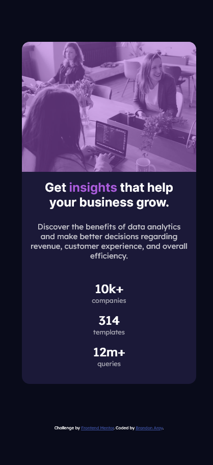

# Frontend Mentor - Stats preview card component solution

This is a solution to the [Stats preview card component challenge on Frontend Mentor](https://www.frontendmentor.io/challenges/stats-preview-card-component-8JqbgoU62). Frontend Mentor challenges help you improve your coding skills by building realistic projects.

## Table of contents

- [Overview](#overview)
  - [The challenge](#the-challenge)
  - [Screenshot](#screenshot)
  - [Links](#links)
- [My process](#my-process)
  - [Built with](#built-with)
  - [What I learned](#what-i-learned)
  - [Continued development](#continued-development)
- [Author](#author)

## Overview

### The challenge

Users should be able to:

- View the optimal layout depending on their device's screen size

### Screenshot



### Links

- Solution URL: (https://github.com/branalex94/frontendmentor-stats-preview-card-component)
- Live Site URL: (https://branalex94.github.io/frontendmentor-stats-preview-card-component/)

## My process

### Built with

- Semantic HTML5 markup
- CSS custom properties
- Flexbox
- Mobile-first workflow

### What I learned

I figured out how to make a colored overlay to put in front of an image element.

```css
.card__hero__overlay {
  position: absolute;
  height: 100%;
  width: 100%;
  top: 0;
  left: 0;
  background-color: hsl(277, 64%, 61%);
  opacity: 0.5;
}
```

### Continued development

I'll be able to use the techniques I learned on this project to better introduce components of my future projects. Better layout and better responsive designs.

## Author

- Frontend Mentor - [@branalex94](https://www.frontendmentor.io/profile/branalex94)
- GitHub - [@branalex94](https://github.com/branalex94/)
